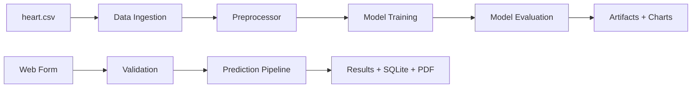

<<<<<<< HEAD
# Heart Disease Prediction — Portfolio Edition

AI-powered cardiovascular risk assessment web application built with Flask, scikit-learn, and a production-style ML pipeline. Designed as an internship-ready portfolio project demonstrating end-to-end machine learning engineering.

## Project Overview

CardioPredict AI analyzes 13 clinical features from the UCI Cleveland Heart Disease dataset and returns:

- Binary prediction (disease / no disease)
- Probability-based risk score (0–100%)
- Risk category (Low / Moderate / High)
- Personalized lifestyle recommendations
- Explainable feature importance
- PDF report export and SQLite prediction history

> **Disclaimer:** This application is for educational and research purposes only. It is not a substitute for professional medical advice.

## Features

| Feature | Description |
|---------|-------------|
| Risk scoring | `predict_proba()` with Low / Moderate / High categories |
| Recommendations | Tailored advice per risk tier + medical disclaimer |
| Bootstrap 5 UI | Responsive, modern interface with validation |
| Model dashboard | Accuracy, Precision, Recall, F1, ROC-AUC, confusion matrix |
| Model comparison | Logistic Regression, Random Forest, XGBoost, SVM |
| Explainable AI | SHAP (optional) or model feature importance |
| Prediction history | SQLite-backed log with timestamps |
| PDF export | Downloadable assessment report |
| Deployment ready | Docker + Render instructions |

## Architecture

```
Heart-Disease-Prediction/
├── app.py                          # Flask routes
├── train.py                        # Single-command training
├── src/Heart/
│   ├── components/                 # Ingestion, transformation, training, evaluation
│   ├── pipeline/                   # Training & prediction pipelines
│   ├── utils/                      # Validation, recommendations, charts, PDF
│   ├── database/                   # SQLite persistence
│   └── constants.py                # Feature definitions & validation rules
├── templates/                      # Bootstrap 5 Jinja2 templates
├── static/                         # CSS, JS, generated charts
├── Artifacts/                      # Model.pkl, Preprocessor.pkl, metrics JSON
├── database/                       # predictions.db (runtime)
└── Notebook_Experiments/Data/      # heart.csv
```



## Tech Stack

- **Backend:** Python, Flask
- **ML:** scikit-learn, XGBoost, pandas, numpy
- **Visualization:** Matplotlib, Seaborn
- **Database:** SQLite
- **Frontend:** Bootstrap 5, Jinja2
- **Export:** fpdf2
- **Deployment:** Docker, Gunicorn, Render

## Installation

```bash
git clone <your-repo-url>
cd Heart-Disease-Prediction-main

python -m venv .venv
# Windows
.venv\Scripts\activate
# macOS/Linux
source .venv/bin/activate

pip install -r requirements.txt
python train.py
python app.py
```

Open **http://localhost:8080**

## Commands

| Command | Purpose |
|---------|---------|
| `python train.py` | Train models, save artifacts, generate dashboard charts |
| `python app.py` | Start development server on port 8080 |
| `gunicorn --bind 0.0.0.0:8080 app:app` | Production server |

## Screenshots

_Add screenshots of the prediction form, results page, dashboard, and history after running locally._

Suggested pages to capture:
1. Home — prediction form
2. Results — risk score + recommendations
3. Dashboard — model metrics and charts
4. History — SQLite prediction log

## Deployment (Render)

1. Push the repository to GitHub.
2. Create a new **Web Service** on [Render](https://render.com).
3. Set **Environment** to Docker (or Python with build command `pip install -r requirements.txt && python train.py`).
4. **Start command:** `gunicorn --bind 0.0.0.0:$PORT app:app`
5. Add environment variables:
   - `FLASK_SECRET_KEY` — random secret string
   - `PORT` — provided by Render
6. Deploy. Artifacts are generated during build via `python train.py`.

### Docker

```bash
docker build -t heart-disease-app .
docker run -p 8080:8080 heart-disease-app
```

## Dataset

UCI Cleveland Heart Disease dataset (`Notebook_Experiments/Data/heart.csv`):
13 clinical attributes + binary target (0 = no disease, 1 = disease).

## License

See [LICENSE](LICENSE).
=======
# heart-disease-prediction
An end-to-end Heart Disease Prediction System built with Flask and Machine Learning. Features include risk assessment, personalized recommendations, prediction tracking, PDF reports, model performance dashboards, and an interactive user-friendly interface.
>>>>>>> d13ddfca34e9341df1824a42399c70c2ca50daa7
